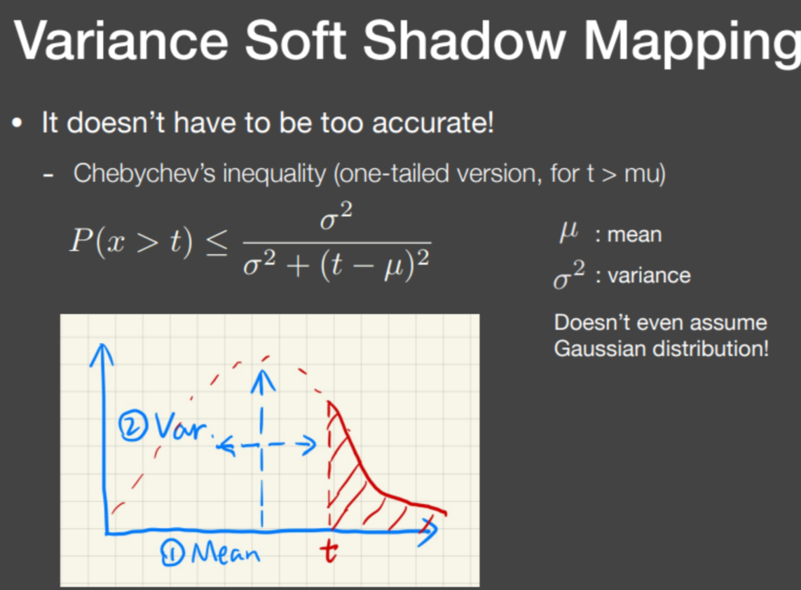
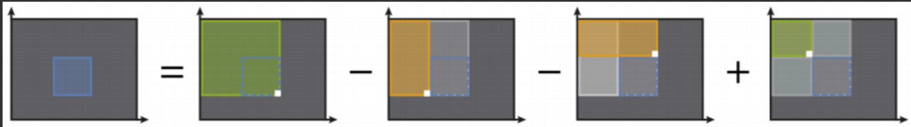
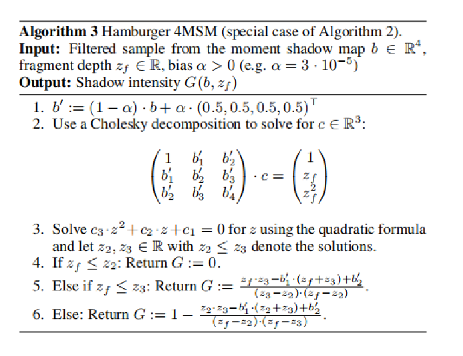

# 实时阴影大作业

本次作业中，本小组在webgl框架下实现了shadow map,PCF,PCSS.并在此基础上增加了多光源，动态物体的支持。此外，还实现了VSSM以及MSM的效果。

只需在vscode中用live server插件打开index.html即可。更换阴影生成方式只需在phongFragment.glsl中的main函数中修改。

## shadow map
ShadowMap是一种用于实时阴影生成的技术，可以分为两个步骤进行。第一个步骤是从光源视角渲染出一张深度图，即ShadowMap。第二个步骤是从摄像机视角渲染实际场景，在渲染过程中将像素点转换到光源空间中，并将其深度与ShadowMap中对应的UV坐标记录的深度进行比较，如果该深度大于ShadowMap上的深度，则该点处于阴影中。

## PCF
Percentage Closer Filtering（PCF）是一种用于生成软阴影的技术。其基本原理是对 Shadow Map 中的多个采样点进行深度比较，并将这些比较结果相加后取平均值，得到一个模糊的可见性结果。具体来说，在对每个像素进行渲染时，PCF 会在其周围的一定范围内进行多次采样，计算每个采样点的可见性，并对这些可见性结果进行平均。这样，阴影的边界会变得更加柔和。
首先，定义一个函数用于在 Shadow Map 中进行多次采样，并计算每个采样点的可见性。该函数接收 Shadow Map、坐标、偏移量和过滤半径作为参数，并返回一个模糊的可见性结果。在函数内部，首先使用一种随机采样技术生成一组采样偏移量。这些偏移量用于在 Shadow Map 中进行多次采样。接着，对于每个采样点，计算其深度值并与当前片元的深度进行比较。如果当前片元的深度大于采样点的深度，则该点被认为处于阴影中。最后，将所有采样点的可见性结果相加并取平均值，得到最终的模糊可见性。
在实际渲染过程中，我们将 PCF 计算得到的模糊可见性应用于片元的颜色计算中。首先，在片元着色器的主程序中，调用 PCF 函数计算当前片元的模糊可见性。接着，将该可见性与 Phong 着色模型的结果相乘，得到最终的颜色值。这样，阴影的边界将变得更加柔和，从而实现软阴影效果
## PCSS
Percentage Closer Soft Shadows（PCSS）是一种改进的软阴影生成技术，通过动态调整采样范围实现更为真实的阴影效果。PCSS 的基本原理可以分为三个步骤：
1. 首先，查找遮挡物并计算其平均深度。定义一个函数用于在 Shadow Map 中查找遮挡物，并计算其平均深度。该函数接收 Shadow Map、坐标和接收点的深度作为参数，并返回遮挡物的平均深度。
2. 然后，根据光源到遮挡物的距离计算半影区域的大小。在主函数中调用 findBlocker 函数获取遮挡物的平均深度。如果没有找到遮挡物，则返回可见性 1.0，否则根据以下公式计算半影区域的大小：

$$w_{\mathrm{Penumbra}}=(d_{\mathrm{Receiver}}-d_{\mathrm{Blocker}})\cdot\frac{w_{\mathrm{Light}}}{d_{\mathrm{Blocker}}}$$

其中，dReceiver 是接收点的深度，dBlocker 是遮挡物的平均深度，wLight 是光源的大小。
1. 最后，使用计算得到的半影区域作为 PCF 的采样范围，进行多次采样并计算最终的可见性。

## 多光源
多光源渲染技术的核心在于分别计算每个光源对场景的影响，然后将这些影响叠加起来。
首先，需要注释掉框架中对光源数量的限制代码，以支持多光源的渲染。考虑到不同光源渲染时需要生成各自的 Shadow Map，因此在切换光源时需要动态绑定 ShadowMap，并对之前的 Frame Buffer 进行处理。为了避免覆盖，每个光源渲染得到的各个像素颜色值需要进行累加，因此需要使用 GL 的 blend 处理。在具体实现时，首先动态绑定当前光源的 Shadow Map，并在渲染前对之前的 Frame Buffer 进行处理，以确保数据正确存储。随后，通过 GL 的 blend 功能，将每个光源的渲染结果进行累加，而不是覆盖。
在不同帧渲染时，需要根据光源的索引设置 uniform 属性。遍历所有的 mesh 对象，根据光源的索引，对这些光源的每一个uniform 属性进行设置。在渲染过程中，根据光源的索引进行操作，区分不同的光源，因此需要对光源的构造增加参数 index。相应地，需要修改 material 类的构造函数，对于继承该类的所有类，同样需要修改其构造函数。
在物体导入的过程中，初始化光源对象，并设置光源的数量。同时，在 engine.js 中，对 renderer 添加两个或更多光源。在渲染循环中，根据需要动态更新和处理多个光源的渲染逻辑。
## 动态物体
首先需要修改项目渲染框架，实现物体的动态过程，包括实现旋转和平移。
在渲染时需要进行逐帧渲染，并且在每帧渲染时清除掉上一帧 Shadow Map 数据，以消除阴影叠加的问题。动态过程的核心是逐帧渲染，每次渲染时根据所需的动态过程进行运动变换，实现旋转和平移的显示。
在 engine.js 中，对于渲染循环，每次记录一个 prevTime，根据当前时间与之前记录时间的差值与设定间隔进行比较，从而实现固定时间的帧更新。在 WebGLRenderer.js中，render 函数的参数增加，每次调用 render 函数时，对特定物体进行运动变换；物体进行了运动，同时 shadowMap 也每帧生成，需要对应更新 lightMVP，以得到实时阴影。
## VSSM

为解决PCSS第一步和第三步慢的问题，VSSM使用切比雪夫不等式，通过提前存储每个像素的深度的期望和二阶矩，构建MIPMAP或SAT（Summed Area Table）。可以做到在O(1)的时间内估计目标区域内的平均遮挡物深度和目标点的visibility。具体细节见GAMES202对应章节。

本小组实现了基于二维SAT的VSSM算法（SAT存储了左上角到当前像素的矩形区域内所有shadow map值的和，使用下图的方法可以进行快速区域查询）。但目前由于对计算着色器等高效实现方法了解不深，选择在着色器中引入循环，累加来实现SAT。这种方式并不高效，因此反而速度会较低（在4070可以60帧流畅，集显上大概10帧）。

具体实现：实现了两组新的着色器，在shadow pass生成的shadow map中第一个通道存储深度，第二个通道存储深度的平方。首先对shadow map沿x轴方向累加（见shaders/satShaderX）生成新的frame buffer，再根据此结果沿y轴方向累加（shaders/satShaderY）。最后将新的结果绑定到光源上，作为`phongFragment.glsl`的uniform变量`uSat`，在这个着色器中按照VSSM公式计算visibility。

为开启VSSM功能，需要再`webglrender`类中将`useSat`置为true（不用时置为false以加快速度），同时在`phongFragment.glsl`里留下调用`VSSM`函数的代码。

## MSM

由于VSSM使用一二阶矩可能效果不是非常理想，所以使用高阶矩进行阴影生成。这里新增三四阶矩，通过提前存储额外信息，可以在O(1）时间快速计算，利用SAT获取区域值，得到的四阶矩利用公式进行计算，得到visibility。参考论文：Moment shadow mapping。

对于三四阶矩的使用，基于进行VSSM的SAT（SAT存储了左上角到当前像素的矩形区域内所有所需值的和）。

具体实现：
1. 首先，在shadow pass存储深度时，需多存储深度的二次，三次，四次的值。
2. 构建好SAT在O(1)时间计算区域的二阶，三阶，四阶中心矩，之后利用公式进行计算，生成阴影。
3. 使用Cholesky分解来求解线性系统，解二次方程得到z的可能值，最后利用z，f与二次方程根的关系，计算阴影强度 

